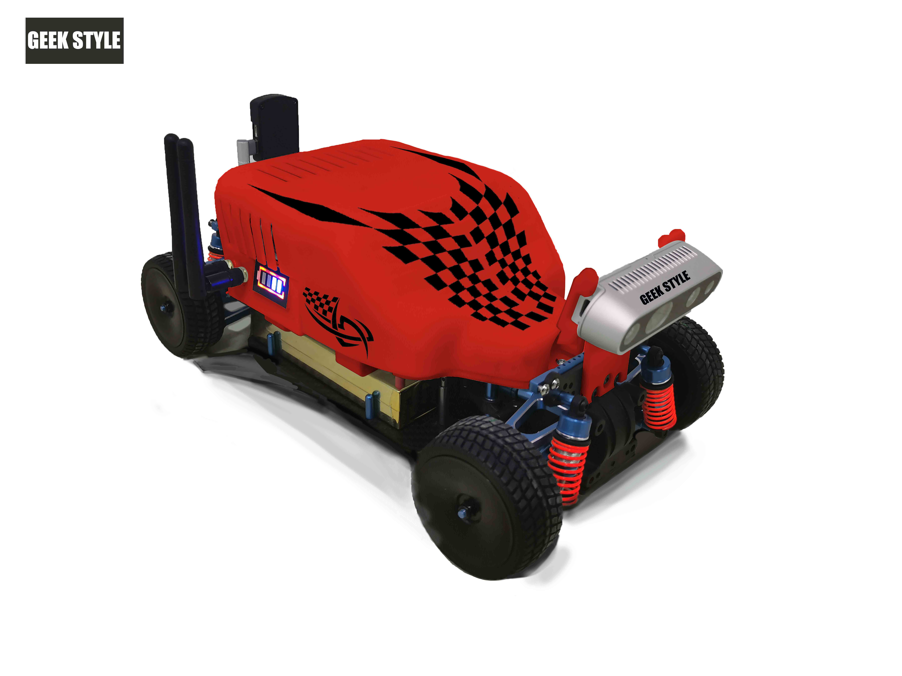
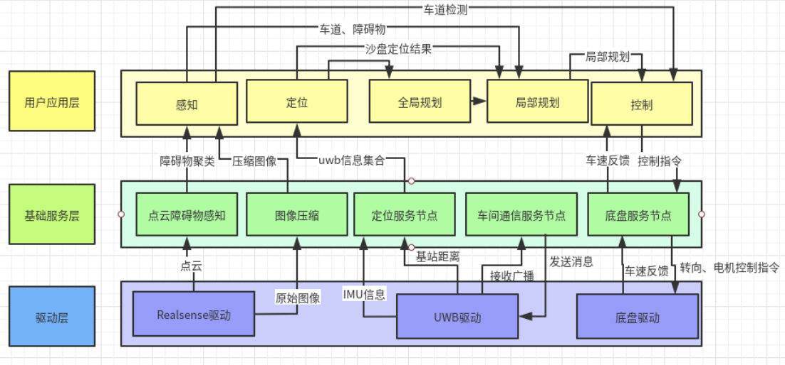

# Geek Car, An Autonomous Application Based On Cyber RT




## Architecture



## Environment Setup

### Code Clone

1. Clone main codes:  `git clone git@github.com:for-geeks/geek-car.git`
2. Update submodule:
```bash
git submodule init
git submodule update
```
### Installation
Let's Install Basical Library and Tools:

ARM Platform :

```bash
sudo bash docker/build/cyber.aarch64.sh
```
X86 Platform:

```bash
sudo bash docker/build/cyber.x86_64.sh
```

## Build Geek car

```bash
bash apollo.sh build
```

## Have a try

More details about teminal.

More details about develop toolschain you can find here：[CyberRT_Developer_Tools](https://github.com/ApolloAuto/apollo/blob/master/docs/cyber/CyberRT_Developer_Tools.md)


## Copyright and License
Geekcar is provided under the MIT License.
